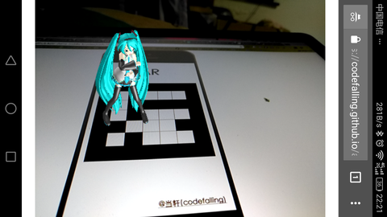

# ar-demo
A AR demo on mobile browser(Android yet) powered by JavaScript

这是一个手机浏览器运行的AR例子

Because there are bugs in the original project that cannot be run, this is the version that can be seen later，Scan the "AR code" to see the dancing girl.

因为原项目有bug无法运行，这个是解决以后可以看到效果的版本，用“扫码”去扫“AR码”可看到跳舞的小女孩


# demo 演示
https://zhengyanwen.github.io/ar-demo/


# SceenShot



# Build

```shell
webpack -p
```

# What about iOS

iOS (safari) do not support `MediaStreamTrack.getSources()`, `MediaDevices.enumerateDevices()` or whatever yet.

# Related Projects

- [js-aruco](https://github.com/jcmellado/js-aruco)

- [ARLIFXController](https://github.com/sitepoint-editors/ARLIFXController)

- [threex.webar](https://github.com/jeromeetienne/threex.webar)

- [threejs-mmd-loader](https://github.com/mrdoob/three.js/blob/dev/examples/webgl_loader_mmd.html)
